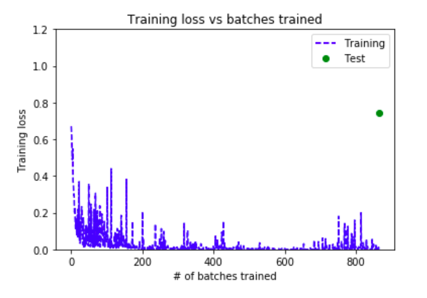
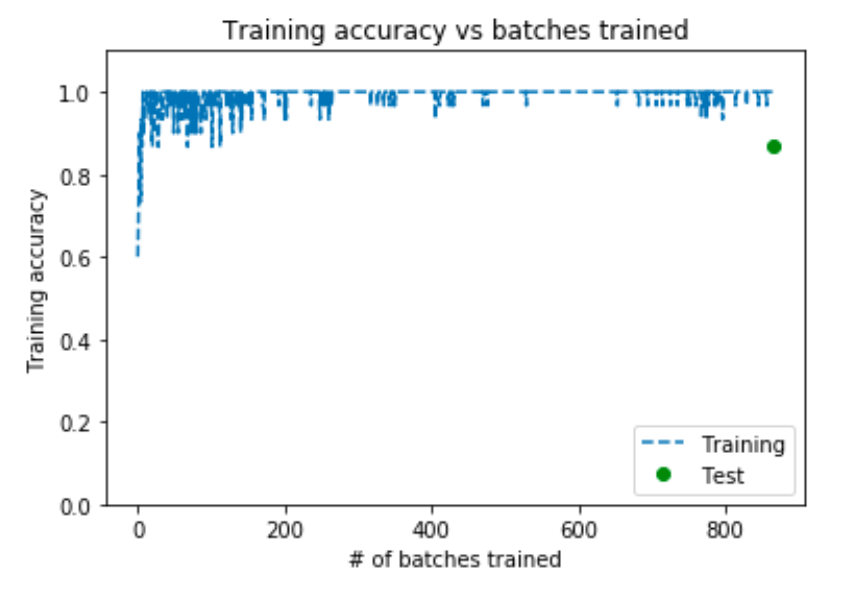

# Transfer Learning to Predict Pneumonia

This project uses transfer learning to predict the cases of Pneumonia. Transfer learning is a machine learning method where model trained for a task is used as a starting point for a similar task. It is motivated by the fact that the information learned by a trained model(in this case [ImageNet](https://en.wikipedia.org/wiki/ImageNet)) contain more generic features (e.g. edge detectors or color blob detectors) that should be useful to many task. The last layers (i.e the dense layers become less useful when reusing the model for other task as those layers are trained to suit the original dataset).

So the big advantages which transfer learning offers are:
- Works even if data is less, like in this case the training size is 5000 images
- Training is fast as the base model is already trained for generic feature extraction

Coming to this dataset,

## Prediciting Pneumonia with the help of transfer Learning
This dataset is avilable on Kaggle [here](https://www.kaggle.com/paultimothymooney/chest-xray-pneumonia). The motivation for me here was to implement transfer learning. I was doing a tutorial on it, and thought of using a dataset from kaggle and hence this repository. I have made this code avilable as a [notebook](https://www.kaggle.com/goelrajat/prediciting-pneumonia-from-chest-xray).

I have used [Xception model](https://keras.io/applications/#xception) (not because of the name) trained on Imagenet as the base model, and implemented the code in Keras with Tensorflow backend. So, lets start with the dataset and then I will move on to the code:

Its a binary classification dataset. The two classes are **Normal** and **Pneumonia**.  

Below is the data distribution of the dataset.

## Parameters
- Learning rate was chosen after training the model couple of times.
- image width and height was specified as the base model.
- batch size, I tried a couple but then stick to 30 as either increasing/decreasing it, wasn't helping in reducing accuracy
- epochs was chosen  because training accuracy reached saturation of around 99.8% and validation accuracy to 100%
- `resume_model` is used when you want to resume from the training from the point you left

## Base Model
Using Xception as the base model, and the reason being, it had the best accuracy on imagenet both Top-1 and Top-5 accuracy. The only thing I tried here was using another layer apart from the final layer. The result was not good and so dropped it in the final model. This code will train the entire model for only be executed is `resume_model` is `False`, and its obvious as well.

## CallBacks for model training
This was interesting part, and the only requirment for me was the `LossHistory` class. But, I thought why not extend it and use a couple of more callbacks. Now a **word of caution**, some callbacks increase the training time because they have their own computation, such as tensorboard. I used in on my mac but not here, because it drastically slowed the training.

## Data Visualisation
2 plots are plotted to visualize the training, namely
- Training loss vs batches trained

 and the other one is
 - training accuracy vs batches trained.

  These are only two plots which came to my mind.

I achieved **81% accuracy** on test data and 99.9% accuracy on training data.
If you have any question, let me know by opening a new issue. Thanks!

## References
2. https://en.wikipedia.org/wiki/Transfer_learning
3. https://machinelearningmastery.com/transfer-learning-for-deep-learning/
1. http://cs231n.github.io/transfer-learning/
4. https://www.youtube.com/watch?v=mPFq5KMxKVw
